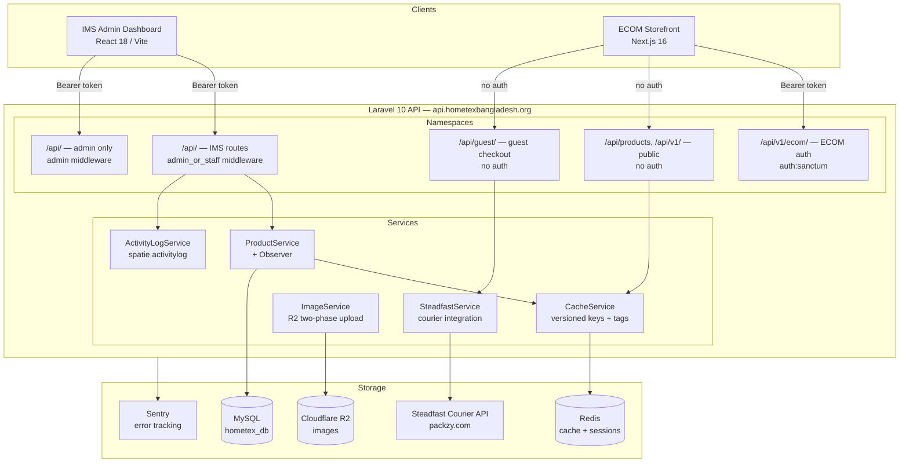
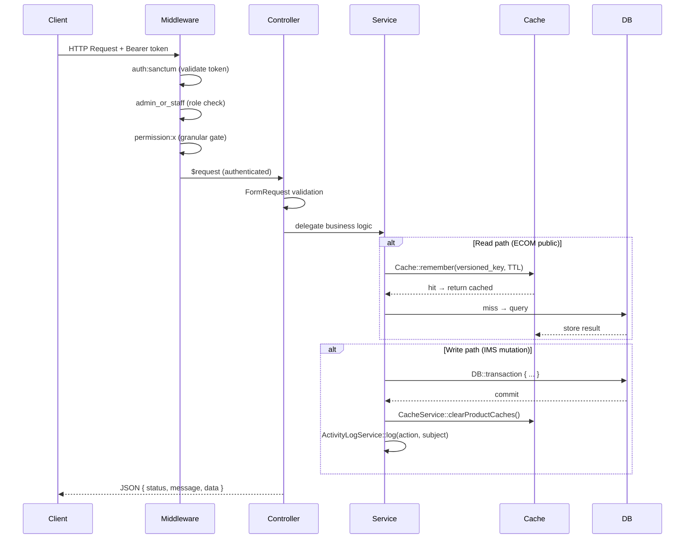
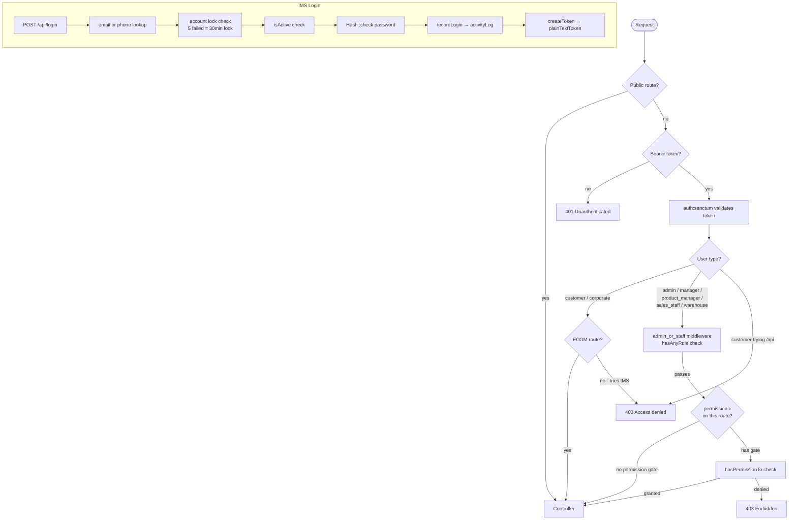
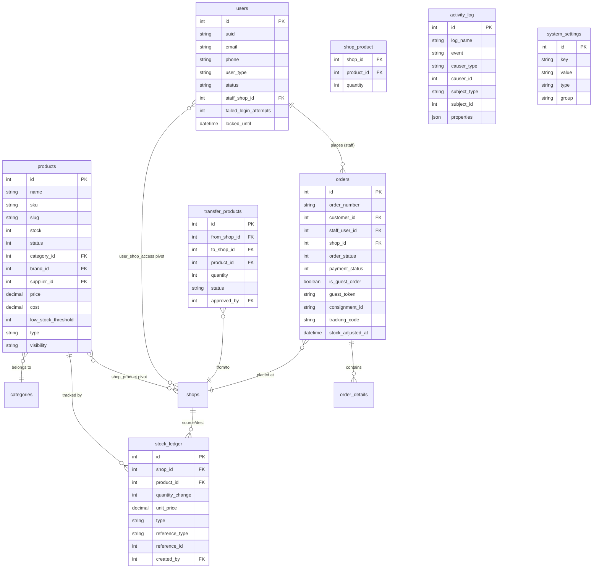
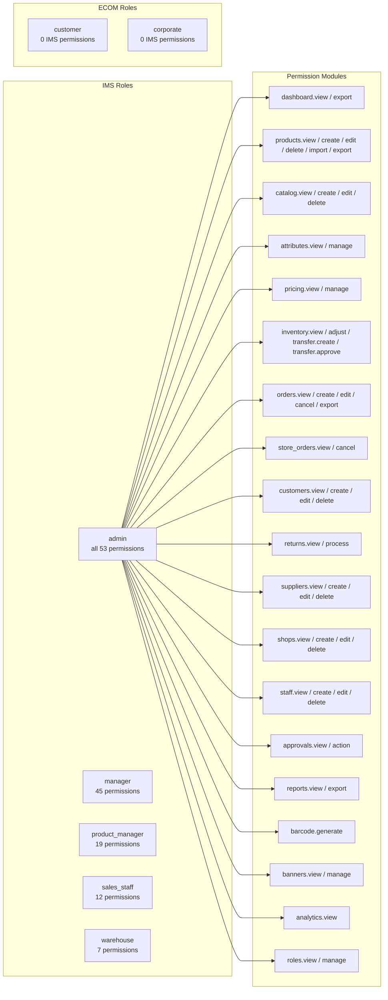

# Hometex Bangladesh — REST API

Laravel 10 backend serving two frontends for a multi-branch home textile retail business in Bangladesh. One API, two consumer namespaces: an admin/staff Inventory Management System (IMS) and a customer-facing e-commerce storefront (ECOM).

**Related repositories:**
- Admin dashboard (IMS): https://github.com/ShahriarHim/hometex-ims
- Customer storefront (ECOM): https://github.com/ShahriarHim/hometex-ecom

---

## The Engineering Problem

A retail business operating multiple physical branches needed:

1. **Unified inventory** across branches — stock at Branch A must be visible and transferable to Branch B, with every movement auditable.
2. **Two very different auth surfaces** — staff users with granular role-based permissions, and customer accounts with Google OAuth and guest checkout, all sharing the same `users` table.
3. **A single API that could not break either frontend** — the IMS and ECOM storefront have conflicting caching needs (IMS needs fresh data on every write; ECOM needs aggressive caching to handle storefront traffic).
4. **Courier integration without coupling** — order placement had to survive Steadfast API outages without failing the customer's checkout.

---

## Tech Stack

| Layer | Choice | Why |
|---|---|---|
| **Framework** | Laravel 10 / PHP 8.1 | Sanctum token auth, route model binding, Eloquent ORM, form requests — ships everything needed without glue code |
| **Auth** | Laravel Sanctum 3.2 | Stateless Bearer tokens for two distinct consumer types (IMS staff, ECOM customer) against the same guard |
| **RBAC** | Spatie laravel-permission 6.0 | Permission-per-route middleware (`permission:x`) instead of role checks scattered across controllers |
| **Audit trail** | Spatie laravel-activitylog 4.12 | Structured audit log with causer, subject, event, property diff — backed by its own `activity_log` table |
| **Image storage** | league/flysystem-aws-s3-v3 + intervention/image 2.7 | Base64 upload → R2 (S3-compatible) using a two-phase pattern: write to R2 first, update DB second, delete old key only after DB commit |
| **HTTP client** | guzzlehttp/guzzle 7.2 | Steadfast courier API integration (order creation, status tracking by consignment/invoice/tracking code) |
| **Monitoring** | sentry/sentry-laravel 4.26 | Exception capture + performance tracing in production |
| **Log viewer** | opcodesio/log-viewer 3.24 | In-app log browser without SSH access to the VM |
| **Cache** | Redis (production) / file (dev) | `CacheService` abstracts both: tag-based flush on Redis, version-key invalidation on file driver — same code path works either way |

---

## System Architecture



---

## Request Lifecycle



---

## Auth Flow



---

## Database Design

78 migrations. Key entity relationships:



---

## RBAC Design

7 roles, 53 granular permissions, all scoped to the `sanctum` guard. Permissions follow `module.action` convention throughout.



**Enforcement**: `admin_or_staff` middleware (checks `hasAnyRole`) gates the entire IMS section. Individual write and sensitive read routes carry an additional `permission:x` middleware check via Spatie's `hasPermissionTo`. The `admin` middleware gates role management, system settings, and review moderation. Customer-type users are blocked at the IMS login controller before a token is issued.

**Shop scoping**: Staff with `staff_shop_id` set on their user record are scoped to that branch only. `Order::getAllOrders` reads `$user->assignedShopId()` and appends a `where shop_id = ?` clause when the resolved shop ID is non-null. Admins and managers with no `staff_shop_id` see all shops.

---

## API Surface

244 registered routes across three namespaces.

### Public — ECOM Storefront (no auth)

| Method | Endpoint | Purpose |
|---|---|---|
| GET | `/api/ping` | Health check |
| GET | `/api/products` | Paginated product list with filters |
| GET | `/api/products/featured` | Featured products (cached 1h) |
| GET | `/api/products/new-arrivals` | Products added in last 30 days (cached 1h) |
| GET | `/api/products/trending` | Trending flag products (cached 1h) |
| GET | `/api/products/bestsellers` | Sorted by `product_analytics.purchase_count` (cached 1h) |
| GET | `/api/products/on-sale` | Active discount window products (cached 15m) |
| GET | `/api/products/slug/{slug}` | Product detail by slug |
| GET | `/api/products/{id}/similar` | Same-category products |
| GET | `/api/products/{id}/recommendations` | `frequently_bought_together` relation |
| GET | `/api/v1/categories/tree` | Full category tree |
| GET | `/api/v1/categories/slug/{slug}` | Category by slug |
| GET | `/api/hero-banners` | Active banner sliders |
| GET | `/api/division` / `/api/districts/{id}` | Address lookup |
| POST | `/api/customer-signup` | Customer registration |
| POST | `/api/customer-login` | Customer login |
| POST | `/api/customer-google-login` | Google OAuth login |
| POST | `/api/corporate-register` | Corporate account registration |
| POST | `/api/guest/checkout` | Guest checkout (no account required) |
| GET | `/api/guest/orders/track` | Guest order tracking by token |

### ECOM — Authenticated Customer (`auth:sanctum`)

| Method | Endpoint | Purpose |
|---|---|---|
| GET | `/api/my-profile` | Customer profile |
| GET | `/api/my-order` | Customer's order history |
| POST | `/api/wish-list` | Add to wishlist |
| POST | `/api/store-review` | Submit product review |
| POST | `/api/check-out-logein-user` | Authenticated checkout |

### IMS — Staff (`admin_or_staff` + `permission:x`)

| Resource | Permission gates |
|---|---|
| Auth (login, logout, me, profile update) | — |
| Products (CRUD + duplicate + CSV import + photo management) | `products.*` |
| Catalog (brands, categories 3-level) | `catalog.*` |
| Attributes + attribute values | `attributes.manage` |
| Pricing formulas | `pricing.manage` |
| Suppliers | `suppliers.*` |
| Shops/Branches | `shops.*` |
| Staff (CRUD + activity per user) | `staff.*` |
| Orders (CRUD + cancel + payment update + item management) | `orders.*` |
| Store Orders / POS | `store_orders.*` |
| Customers (CRUD + order history) | `customers.*` |
| Inventory transfers (create + approve/reject) | `inventory.transfer.*` |
| Stock adjustments | `inventory.adjust` |
| Returns | `returns.*` |
| Reports (sales trend, order status, top products, monthly) | `reports.view` |
| Corporate approvals | `approvals.*` |
| Analytics | `analytics.view` |
| Activity logs | — (any staff) |

### IMS — Admin only (`admin` middleware)

| Resource |
|---|
| Roles & Permissions — CRUD roles, sync permissions, assign user roles |
| System Settings — GET all (grouped) + bulk PUT |
| Banners — full CRUD + reorder + config |
| Review Moderation — pending, approve, reject, bulk actions |

---

## Key Engineering Decisions

**1. One `users` table for all user types, Spatie roles as the discriminator — not separate tables.**

The original schema had a `sales_managers` table (migration `2026_06_20_110000` drops it). Unifying all users — admin, warehouse staff, customers, corporate buyers — into a single table with a `user_type` column and Spatie roles means one authentication path, one token validation, one `soft_delete` scope. The cost is that login must explicitly block `user_type === 'customer'` from IMS entry. The benefit is that adding a new staff role requires zero schema changes.

**2. Cache versioning as the driver-agnostic invalidation strategy.**

`CacheService` maintains four version counters (`cache_version:products`, `:categories`, `:banners`, `:navigation`) stored in the cache itself. Every product cache key is prefixed `v{version}:...`. When `clearProductCaches()` runs, it increments the version — old cache entries become unreachable by key without requiring a flush. On Redis this is complemented by tag-based flushing; on file driver the version strategy is the only mechanism. `ProductObserver` wires this to every Eloquent lifecycle event so no controller mutation can forget to invalidate.

**3. LEFT JOIN search over `whereHas` subqueries in the product list.**

`ProductService::getPaginatedProducts` uses LEFT JOINs to categories, sub-categories, and child sub-categories when a search term is present. This is 3-10x faster than `whereHas` subqueries on large catalogs because `whereHas` generates correlated subqueries that MySQL cannot use indexes for. A FULLTEXT index on `(name, sku)` was added in migration `2026_06_20_120000` alongside composite indexes on `(shop_id, product_id)` in `shop_product`.

**4. Stock ledger as a signed-quantity audit table, not a running total.**

`stock_ledger` records `quantity_change` (negative for deductions, positive for returns/adjustments) with a `type` enum covering eight movement types: `ecommerce_order`, `store_order`, `pos_order`, `manual`, `restore`, `return`, `transfer_in`, `transfer_out`. Every stock movement writes a ledger row inside the same `DB::transaction`. The running balance can always be reconstructed from the ledger — which matters for audits and for detecting stock inconsistencies introduced outside the application.

**5. Steadfast courier integration that cannot block order placement.**

`GuestCheckoutController::createSteadfastOrder` catches all `Throwable` and returns a null consignment ID if the Steadfast API is down or times out. The order is created without a consignment ID rather than failing. The tradeoff is that some orders may need manual courier entry when Steadfast is unavailable, but no customer ever sees a 500 from a third-party outage. `consignment_id` and `tracking_code` are nullable columns on `orders`.

**6. Two-phase R2 upload to prevent data loss on DB failure.**

In `ImageService`: the new image is uploaded to R2 first, then the database row is updated with the new key, then the old R2 key is deleted — only after the DB write succeeds. If the DB write fails, the new R2 object is orphaned but the user's existing record remains intact. The reverse order (delete old → DB update → upload new) would result in data loss on any failure mid-sequence.

---

## Scope and Metrics

| Metric | Count |
|---|---|
| Controllers | 47 (39 IMS + 8 ECOM) |
| Models | 49 |
| Migrations | 78 |
| Registered routes | 244 |
| Form Request classes | 50 (paired Store/Update per resource) |
| Service classes | 10 |
| Observer classes | 3 |
| Policy classes | 25 |
| Custom middleware | 5 |
| RBAC roles | 7 (5 IMS + 2 ECOM) |
| RBAC permissions | 53 granular, `module.action` format |
| Permission middleware usages in routes | 103 |
| Manager classes | 5 (Image, Order, Price, Report, Script) |
| External integrations | 1 (Steadfast courier) |

---

## What I Would Do Differently

- **Formal API Resources throughout** — Some older controllers return inline `response()->json([...])` arrays; newer controllers use dedicated Resource classes. A complete pass converting all responses to API Resource classes would make the contract explicit and the JSON shape independently testable.
- **Queue the audit log writes** — `ActivityLogService::log` is called synchronously after `DB::commit()`. It swallows exceptions but still adds latency to write operations. Every mutation that calls it should dispatch a queued job instead. Redis and Supervisor are already in place — it just needs to be wired.
- **Feature tests for RBAC boundaries** — There are no automated tests. Given 53 permissions across 7 roles, a matrix covering RBAC boundaries — can `sales_staff` create a product? can `warehouse` approve a transfer? — would catch regressions on any permission change before they reach production.

---

## Getting Started

```bash
# Clone and install
git clone https://github.com/ShahriarHim/hometex-api
cd hometex-api
composer install

# Configure environment
cp .env.example .env
php artisan key:generate
# Edit .env — set DB_*, CACHE_DRIVER, AWS_* for R2, STEADFAST_*, SENTRY_LARAVEL_DSN

# Database setup
php artisan migrate
php artisan db:seed --class=RolePermissionSeeder
php artisan db:seed --class=SystemSettingSeeder
php artisan db:seed --class=AdminSeeder

# Production cache (skip for local dev)
php artisan config:cache
php artisan route:cache

php artisan serve
```

**Minimum PHP**: 8.1 | **Minimum MySQL**: 8.0 (uses FULLTEXT index, JSON functions) | **Redis**: Required for production; file driver works for local dev

### Required Environment Variables

```env
APP_URL=
DB_HOST=
DB_DATABASE=hometex_db
DB_USERNAME=
DB_PASSWORD=

CACHE_DRIVER=redis          # or file for local dev
QUEUE_CONNECTION=redis

AWS_ACCESS_KEY_ID=          # Cloudflare R2 key
AWS_SECRET_ACCESS_KEY=
AWS_DEFAULT_REGION=auto
AWS_BUCKET=
AWS_ENDPOINT=               # https://<account-id>.r2.cloudflarestorage.com
R2_PUBLIC_URL=

STEADFAST_API_KEY=
STEADFAST_SECRET_KEY=

SENTRY_LARAVEL_DSN=
ADMIN_SEED_EMAIL=admin@example.com
```

---

## Related Repositories

| Project | Repository | Stack |
|---|---|---|
| Admin IMS dashboard | https://github.com/ShahriarHim/hometex-ims | React 18 + Vite |
| Customer storefront | https://github.com/ShahriarHim/hometex-ecom | Next.js 16 + TypeScript |

---

*Built by Shahriar Him. Portfolio project — client system for Hometex Bangladesh.*
